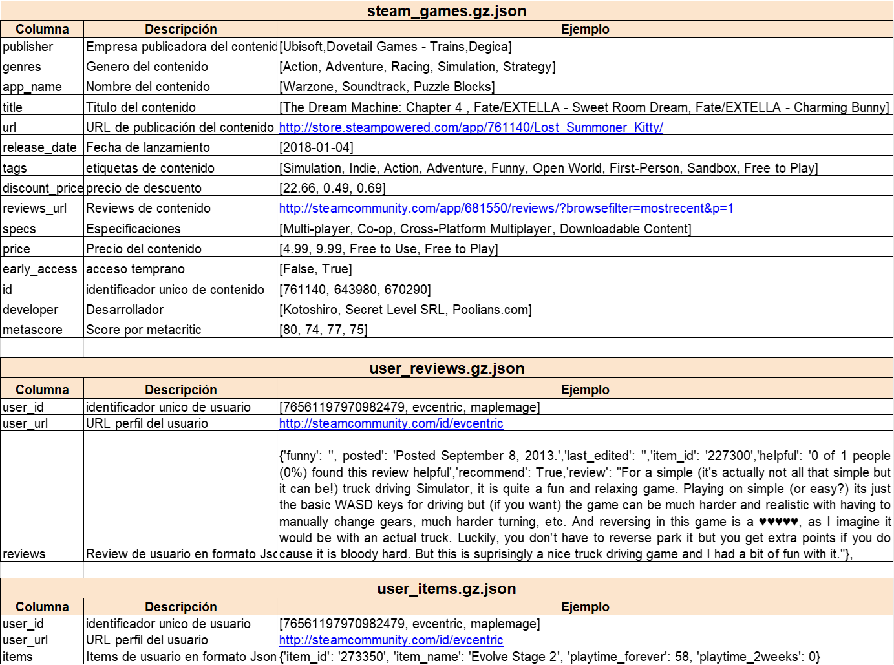
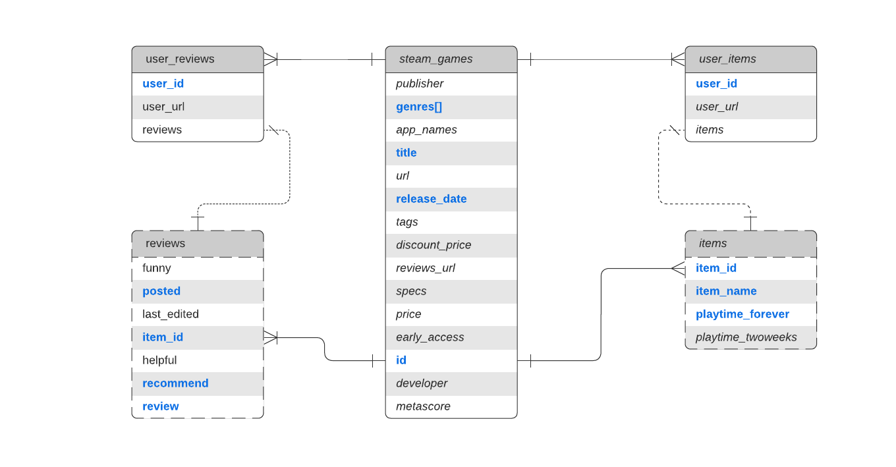

# HRY_PT04_PI01
Exploring a publicly available dataset on video game reviews involved cleaning and transforming data, creating endpoints to query relevant data for model development, and building and publishing a recommendation model aimed at new players.

**Introduction**

This project is based on a set of data sources related to video games. The purpose is to analyze the information available there, through the application of data engineering and machine learning techniques to answer certain questions posed and give the possibility to consult those answers via web. According to the available data:
+ 1-Which is the year with the most hours played per video game genre?
+ 2-Which is the user who accumulates more hours played per genre of videogames and how many hours per year did this user play videogames of this genre?
+ 3-What is the sentiment of each review published by users and available in the database?
+ 4-What are the 3 most recommended games by users per year?
+ 5-What are the 3 games least recommended by users per year?
+ 6-How many positive, neutral and negative reviews have users posted per year?
+ 7-What are the top 5 recommended video games for a given user that is randomly specified?

**1-Work proposal**

It is proposed to carry out a data science work that includes the following steps:
+ 1.1-Realize the exploration of a set of data sources alluding to video games,  
+ 1.2-Apply a sentiment analysis on user reviews, 
+ 1.3-Generate a game recommendation model per user, based on the reviews posted by other users, 1.4-Apply a set of data sources related to videogames, 1.4-Apply a set of data sources related to videogames.
+ 1.4-Apply a set of transformations per question to be answered in order to arrive at simple datasets containing the search criteria and the searched answer.
+ 1.5-Build functions to allow the query of the questions posed.
+ 1.6-Expose the functions through endpoints that are made available through FastApi
+ 1.7-Deploy the exposed endpoints via Render

**2- Data sources**

Here is the access to the source data (not included in the GitHub repository for space reasons)

[DataSets Repository](https://drive.google.com/drive/folders/1HqBG2-sUkz_R3h1dZU5F2uAzpRn7BSpj)

And this is the originally provided data dictionary

**3-Data exploration (EDA)**

After an initial exploration that consists of decompressing and un-nesting the data, the following data model is obtained from a relational model point of view.

When generating the sentiment analysis for each review, two columns are generated: one with the sentiment score and the other with the mood, which is the classification given to the review according to the score obtained.
On these two fields, the exploration is focused on identifying the distribution of mood based on the score.
An important finding is the large number of reviews with zero score. This suggests us to explore in detail why there are so many, and leads us to try to identify the language of each review.
This part is achieved with the use of the langdetect library. It is found that 77.1% of the reviews are in English. When reviewing the distribution of the mood with English-only reviews, the trend is mostly positive in about 2/3 of the cases: the other third is divided in roughly equal parts of neutral and negative reviews.
However, when reviewing the distribution of non-English reviews, a completely different distribution is found, where approximately half of the total cases are neutral and of the other half 3/4 are positive and the remaining quarter are negative.
One hypothesis is that the algorithm used by the nltk library is not very good at interpreting reviews in languages other than English, so it assigns neutral in a large part of the cases.

**4-Data Transformation (ETL)**

The main strategy to deal with the scarcity of rendering resources at the time of deployment is the generation of specific datasets to access them when answering each question, which is addressed by a separate function in each case

4.1-To answer the question: "What is the year with the most hours played per video game genre?", it was necessary:
+ 4.1.1. Unannotate the steam_games dataset to obtain the genres per game 4.1.2.
+ 4.1.2. Obtain the year of publication per game, after validating the publication date.
+ 4.1.3. Combine the obtained dataset with the unnested user_items dataset in order to obtain the total time played for each game.
+ 4.1.4. Group the obtained dataset by genre and year to obtain the total time played per year of release of the games belonging to each genre.
+ 4.1.5. Identify, for each year, the genre with the most hours played.
+ 4.1.6. Generate a flat file with this information that can be consumed by the main.py file that will contain the functions associated to the endpoints.

4.2-To answer the question: "Which user accumulates the most hours played per video game genre and how many hours per year did this user play video games of this genre?", it was necessary:
+ 4.2.1. Unannotate the steam_games dataset to obtain the genres per game 4.2.2.
+ 4.2.2. Calculate the total number of hours played per user per genre.
+ 4.2.3. Identify the user with the most hours played per gender 4.2.4.
+ 4.2.4. Generate a flat file with this information that can be consumed by the main.py file that will contain the functions associated to the endpoints.

4.3-To answer the question: "What are the 3 most recommended games by users per year?", it was necessary:
+ 4.3.1. Obtain the year of release per game from the steam_games dataset, after validating the release date; 4.3.2.
+ 4.3.2. Calculate the mood for each review in the user_reviews dataset.
+ 4.3.3. Combine the steam_games dataset with the user_reviews dataset to obtain the year of publication per game with the respective mood and the flag of recommendation of the reviews per user.
+ 4.3.4. Calculate the posting year of each review published by the users, after validating each of these dates.
+ 4.3.5. Calculate the positive recommendation intent for each user review, verifying whether it has a positive recommendation flag and whether the mood of the review is positive or neutral.
+ 4.3.6. Calculate the number of times a game has been recommended per year.
+ 4.3.7. Generate a flat file with this information that can be consumed by the main.py file that will contain the functions associated to the endpoints.

4.4-To answer the question: "What are the 3 least recommended games by users per year?", it was necessary:
+ 4.4.1. Get the year of release per game from the steam_games dataset, after validating the release date; 4.4.2.
+ 4.4.2. Calculate the mood for each review in the user_reviews dataset.
+ 4.4.3. Combine the steam_games dataset with the user_reviews dataset to obtain the year of publication per game with the respective mood and the recommendation flag of the reviews per user.
+ 4.4.4. Calculate the posting year of each review published by the users, after validating each of these dates.
+ 4.4.5. Calculate the negative recommendation intent for each user review, verifying if it has a negative recommendation flag and if the mood of the review is negative.
+ 4.4.6. Calculate the number of times a game has been reviewed per year.
+ 4.4.7. Generate a flat file with this information that can be consumed by the main.py file that will contain the functions associated to the endpoints.

4.5-To answer the question, "How many positive, neutral, and negative reviews have users posted per year?", it was necessary:
+ 4.5.1. Obtain the year of publication per game from the steam_games dataset, after validating the publication date; 4.5.2.
+ 4.5.2. Calculate the mood for each review in the user_reviews dataset.
+ 4.5.3. Combine the steam_games dataset with the user_reviews dataset to obtain the year of publication per game with the respective mood of the reviews per user.
+ 4.5.4. Generate a flat file with this information that can be consumed by the main.py file that will contain the functions associated to the endpoints.

4.6-To answer the question: "What are the 5 recommended video games for a given user that is randomly specified?", it was necessary:
+ 4.5.1-Generate a pivot table from the user_reviews dataset where each column represents a video game, each row a user, and the intersection between these the review of each user for that game. The set of reviews of a user for all the games represents the vector of user's likes and dislikes.
+ 4.5.2. Apply the cosine_similarity algorithm of the metrics.pairwise module of the sklearn library to the described matrix.
+ 4.5.3. Generate a function to determine from a given user ID the closeness between vectors and return the results sorted by this criterion.
+ 4.5.4. Generate a flat file with this information that can be consumed by the main.py file that will contain the functions associated to the endpoints.

**5- Deployment**

In order to deploy what has been developed it was necessary:
+ 5.1-Build a main.py file with the endpoints to be deployed and with the functions that consume the datasets built to answer each specific question. 
+ 5.2-Include a requierements.txt file with the specification of the libraries that render must use while the service is active.
+ 5.3-Create a repository in GitHub with all the content of the project to be deployed.
+ 5.4-Create a web service in render pointing to the created GitHub repository
+ 5.5-Run the service so that the local application is deployed with the command uvicorn main:app --reload
+ 5.6-Test the deployed endpoints 

**6-Project Video**

[Here is a short video about the project.](https://www.youtube.com/watch?v=1Md5Tw56Ovk)

**7-Conclusions**

This repository presents a basic level of data science work that includes data exploration, transformation and analysis phase, including ML techniques for sentiment analysis and generation of recommendations. Also included is the deployment of the query interfaces built on the web tested to satisfaction. 
This repository is suggested as a guide for those starting their engineering and data science learning journey.
Greetings!